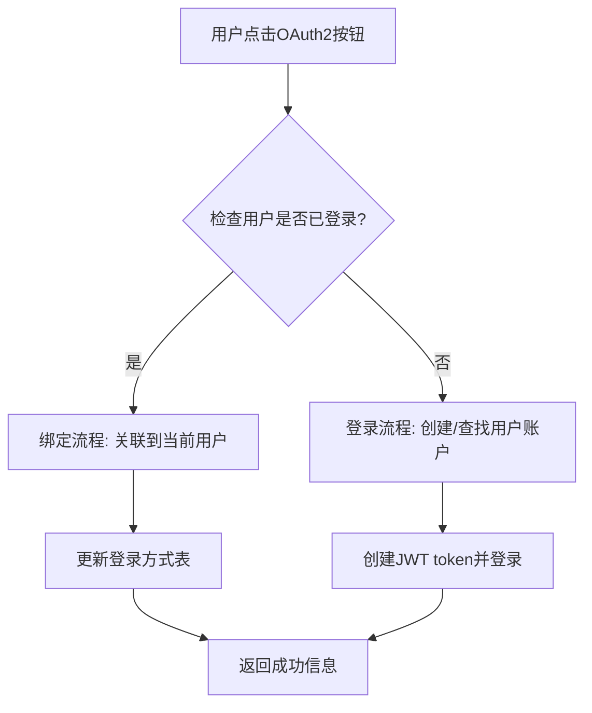

# 多登录方式绑定功能设计规划文档

## 文档信息

- **文档版本**: v1.0
- **创建日期**: 2026-01-22
- **作者**: AI Assistant
- **文档类型**: 功能设计规划
- **关联项目**: Google OAuth2 Demo

## 目录

1. [背景分析](#背景分析)
2. [当前数据结构问题分析](#当前数据结构问题分析)
3. [需求分析](#需求分析)
4. [设计方案](#设计方案)
5. [数据库设计](#数据库设计)
6. [API设计](#api设计)
7. [前端设计](#前端设计)
8. [安全考虑](#安全考虑)
9. [实施计划](#实施计划)
10. [测试策略](#测试策略)
11. [风险评估](#风险评估)
12. [总结](#总结)

## 背景分析

### 当前系统架构

OAuth2 Demo项目目前支持以下登录方式：
- 本地用户名/密码登录
- Google OAuth2 SSO
- GitHub OAuth2 SSO
- Twitter OAuth2 SSO

### 现有问题

当前系统的一个用户只能绑定一种登录方式，即：
- 本地用户只能用用户名/密码登录
- OAuth2用户只能用对应的第三方平台登录

这限制了用户的使用体验，比如：
- Google用户想要同时支持本地密码登录
- 本地用户想要绑定Google账号以便快速登录

## 当前数据结构问题分析

### UserEntity 结构分析

```java
@Entity
@Table(name = "users")
public class UserEntity {
    // ... 其他字段 ...

    @Enumerated(EnumType.STRING)
    @Column(nullable = false)
    private AuthProvider authProvider = AuthProvider.LOCAL;

    @Column(length = 255)
    private String providerUserId;  // OAuth2提供商的用户ID

    // ...
}
```

### 问题点

1. **单一提供商限制**
   - `authProvider` 字段只能存储一个枚举值
   - 无法表示用户同时支持多种登录方式

2. **提供商用户ID冲突**
   - `providerUserId` 只能存储一个第三方平台的用户ID
   - 无法同时绑定多个OAuth2提供商

3. **业务逻辑限制**
   - 用户注册/登录逻辑基于单一提供商假设
   - OAuth2回调处理不支持多账户绑定

## 需求分析

### 功能需求

#### 核心功能
1. **多登录方式绑定**: 用户可以绑定多种登录方式
2. **主登录方式**: 用户可以设置一个主要的登录方式
3. **登录方式管理**: 用户可以添加/移除登录方式
4. **无缝切换**: 用户可以在不同登录方式间无缝切换

#### 用户场景
1. **场景A**: 本地用户绑定Google账号
   - 用户A用用户名/密码注册
   - 后续绑定Google账号
   - 可以用Google SSO快速登录

2. **场景B**: OAuth2用户添加本地密码
   - 用户B用Google登录创建账户
   - 后续设置本地用户名/密码
   - 可以选择用Google或密码登录

3. **场景C**: 多平台OAuth2绑定
   - 用户C同时绑定Google和GitHub账号
   - 可以用任一平台登录

### 非功能需求

#### 安全性
1. **账户安全**: 防止账户被恶意绑定
2. **密码安全**: 本地密码的安全存储和验证
3. **OAuth2安全**: OAuth2流程的安全性保证

#### 用户体验
1. **直观界面**: 清晰的登录方式管理界面
2. **状态同步**: 各端状态实时同步
3. **错误处理**: 友好的错误提示

#### 扩展性
1. **新平台支持**: 易于添加新的OAuth2平台
2. **配置灵活**: 可配置的登录方式组合

## 设计方案

### 总体设计原则

1. **向后兼容**: 不破坏现有功能
2. **渐进迁移**: 支持从单登录方式到多登录方式的平滑迁移
3. **数据完整性**: 保证数据迁移的安全性
4. **API一致性**: 保持现有API接口的兼容性

### 架构设计

#### 1. 数据层重构

**当前架构**：
```
UserEntity (单一authProvider)
    ↓
单一登录方式
```

**目标架构**：
```
UserEntity (基础信息)
    ↓
UserLoginMethod (多登录方式关联)
    ↓
多种登录方式 (LOCAL, GOOGLE, GITHUB, TWITTER)
```

#### 2. 业务逻辑重构

**登录流程**：
1. 用户选择登录方式
2. 系统验证该登录方式是否已绑定账户
3. 如果已绑定，直接登录
4. 如果未绑定，根据策略处理（创建新账户或关联现有账户）

**绑定流程**：
1. 用户在登录状态下选择添加新的登录方式
2. 验证新登录方式的可用性
3. 建立绑定关系
4. 更新用户状态

## 数据库设计

### 新增表结构

#### 1. user_login_methods 表

```sql
-- 用户登录方式关联表
CREATE TABLE user_login_methods (
    id BIGINT AUTO_INCREMENT PRIMARY KEY,
    user_id BIGINT NOT NULL,
    auth_provider VARCHAR(50) NOT NULL,        -- LOCAL, GOOGLE, GITHUB, TWITTER
    provider_user_id VARCHAR(255),             -- 第三方平台用户ID (OAuth2时必填)
    provider_email VARCHAR(255),               -- 第三方平台邮箱
    provider_username VARCHAR(255),            -- 第三方平台用户名
    local_username VARCHAR(255),               -- 本地用户名 (LOCAL时使用)
    local_password_hash VARCHAR(255),          -- 本地密码哈希 (LOCAL时使用)
    is_primary BOOLEAN DEFAULT FALSE,          -- 是否为主登录方式
    is_verified BOOLEAN DEFAULT FALSE,         -- 是否已验证
    linked_at TIMESTAMP DEFAULT CURRENT_TIMESTAMP,
    last_used_at TIMESTAMP NULL,
    created_at TIMESTAMP DEFAULT CURRENT_TIMESTAMP,
    updated_at TIMESTAMP DEFAULT CURRENT_TIMESTAMP,

    -- 约束
    FOREIGN KEY (user_id) REFERENCES users(id) ON DELETE CASCADE,
    UNIQUE KEY uk_user_provider (user_id, auth_provider),  -- 一个用户只能绑定一个提供商一次
    UNIQUE KEY uk_local_username (local_username),         -- 本地用户名唯一
    UNIQUE KEY uk_provider_user (auth_provider, provider_user_id)  -- 第三方用户ID在同平台唯一
);

-- 索引
CREATE INDEX idx_user_login_methods_user_id ON user_login_methods(user_id);
CREATE INDEX idx_user_login_methods_provider ON user_login_methods(auth_provider, provider_user_id);
CREATE INDEX idx_user_login_methods_primary ON user_login_methods(user_id, is_primary);
```

#### 2. 现有表结构调整

**users 表调整**：
```sql
-- 移除不再需要的字段
ALTER TABLE users DROP COLUMN auth_provider;
ALTER TABLE users DROP COLUMN provider_user_id;
ALTER TABLE users DROP COLUMN password_hash;  -- 移到user_login_methods表

-- 添加新字段
ALTER TABLE users ADD COLUMN primary_login_method_id BIGINT NULL;
ALTER TABLE users ADD FOREIGN KEY (primary_login_method_id) REFERENCES user_login_methods(id);
```

### 数据迁移策略

#### 阶段1: 结构迁移
1. 创建新表 `user_login_methods`
2. 将现有用户数据迁移到新表结构
3. 保留原有表结构用于回滚

#### 阶段2: 数据迁移脚本
```sql
-- 迁移本地用户
INSERT INTO user_login_methods (
    user_id, auth_provider, local_username, local_password_hash,
    is_primary, is_verified, linked_at
)
SELECT
    id, 'LOCAL', username, password_hash,
    TRUE, email_verified, created_at
FROM users
WHERE auth_provider = 'LOCAL';

-- 迁移OAuth2用户
INSERT INTO user_login_methods (
    user_id, auth_provider, provider_user_id, provider_email,
    is_primary, is_verified, linked_at
)
SELECT
    id, LOWER(auth_provider), provider_user_id, email,
    TRUE, TRUE, created_at
FROM users
WHERE auth_provider IN ('GOOGLE', 'GITHUB', 'TWITTER');
```

#### 阶段3: 清理和优化
1. 验证数据迁移完整性
2. 删除旧字段
3. 更新索引和约束

## API设计

### 新增API接口

#### 1. 登录方式管理API

```java
@RestController
@RequestMapping("/api/user/login-methods")
public class LoginMethodController {

    // 获取用户的登录方式列表
    @GetMapping
    public ResponseEntity<?> getLoginMethods() {
        // 返回用户的登录方式列表
    }

    // 移除登录方式 (不能移除最后一个登录方式)
    @DeleteMapping("/{methodId}")
    public ResponseEntity<?> removeLoginMethod(@PathVariable Long methodId) {
        // 移除指定的登录方式，至少保留一种登录方式
    }

    // 设置主登录方式
    @PutMapping("/{methodId}/primary")
    public ResponseEntity<?> setPrimaryLoginMethod(@PathVariable Long methodId) {
        // 设置主登录方式
    }
}
```

#### 2. OAuth2流程优化设计

##### 🎯 统一回调URL策略

**核心思想**: 同一个OAuth2回调URL，根据用户当前登录状态智能选择行为

**优势**:
- ✅ **简化配置**: OAuth2提供商只需配置一个回调URL
- ✅ **无缝体验**: 用户无需区分"登录"还是"绑定"按钮
- ✅ **统一流程**: 所有OAuth2交互使用相同的技术栈
- ✅ **向后兼容**: 不破坏现有OAuth2登录功能

**智能路由逻辑**:


**安全性保证**:
- 🔒 **绑定验证**: 已登录用户绑定时验证账户所有权
- 🔒 **防止冲突**: 检查OAuth2账户是否已被其他用户绑定
- 🔒 **审计记录**: 记录所有登录方式的添加操作

#### 3. 修改现有API

**修改 `/api/auth/login` (本地登录)**:
```java
@PostMapping("/login")
public ResponseEntity<?> login(@RequestBody LoginRequest request) {
    // 1. 查找对应的login method
    // 2. 验证密码
    // 3. 生成JWT token
    // 4. 返回用户信息
}
```

**修改 OAuth2 登录成功处理器 (智能路由)**:
```java
public AuthenticationSuccessHandler oauth2SuccessHandler() {
    return (request, response, authentication) -> {
        // 🎯 统一回调URL设计 - 通过用户登录状态智能路由

        // 1. 检查当前是否有用户已登录 (通过SecurityContext或JWT Cookie)
        boolean isUserLoggedIn = checkCurrentUserLoggedIn(request);

        if (isUserLoggedIn) {
            // 📌 绑定场景：已登录用户绑定新的OAuth2登录方式
            Long currentUserId = getCurrentUserId(request);
            handleOAuth2Binding(currentUserId, authentication, response);
        } else {
            // 📌 登录场景：未登录用户通过OAuth2登录
            handleOAuth2Login(authentication, response);
        }
    };
}

private boolean checkCurrentUserLoggedIn(HttpServletRequest request) {
    // 检查是否有有效的JWT token (从Cookie或Header)
    return jwtTokenService.validateCurrentToken(request) != null;
}

private void handleOAuth2Binding(Long currentUserId, Authentication authentication,
                                HttpServletResponse response) {
    // 1. 验证OAuth2用户信息
    // 2. 检查是否已被其他用户绑定
    // 3. 创建新的登录方式关联
    // 4. 返回成功信息（不生成新的JWT token，因为用户已登录）
}

private void handleOAuth2Login(Authentication authentication, HttpServletResponse response) {
    // 1. 查找或创建用户账户
    // 2. 生成JWT token
    // 3. 设置Cookie并返回用户信息
}
```

### 请求/响应数据结构

#### BindLoginMethodRequest
```json
{
  "authProvider": "LOCAL",
  "localUsername": "johndoe",
  "localPassword": "password123"
}
```

#### LoginMethodDto
```json
{
  "id": 1,
  "authProvider": "GOOGLE",
  "providerEmail": "john@gmail.com",
  "isPrimary": true,
  "isVerified": true,
  "linkedAt": "2026-01-22T10:00:00Z",
  "lastUsedAt": "2026-01-22T15:30:00Z"
}
```

## 前端设计

### 页面结构调整

#### 1. 登录页面改进
```
登录页面
├── 本地登录表单
├── OAuth2登录按钮 (统一的按钮，支持登录和绑定)
└── 状态提示 (根据登录状态显示不同文案)
```

**智能按钮设计**:
- **未登录用户**: 显示"使用Google登录"，"使用GitHub登录"等
- **已登录用户**: 显示"绑定Google账户"，"绑定GitHub账户"等
- **已绑定用户**: 显示"已绑定Google" (灰色不可点击)

#### 2. 用户设置页面 (新增)
```
用户设置页面
├── 基本信息
├── 登录方式管理
│   ├── 当前登录方式列表
│   ├── 快速绑定按钮 (OAuth2)
│   ├── 本地密码设置
│   └── 设置主登录方式
└── 安全设置
```

### 组件设计

#### OAuth2LoginButton 组件 (改进版)

```typescript
interface OAuth2LoginButtonProps {
  provider: 'google' | 'github' | 'x';
  onSuccess?: (user: User) => void;
  onError?: (error: string) => void;
}

const OAuth2LoginButton: React.FC<OAuth2LoginButtonProps> = ({
  provider, onSuccess, onError
}) => {
  const { user, isAuthenticated } = useAuth();

  // 智能按钮状态
  const getButtonState = () => {
    if (!isAuthenticated) {
      // 未登录用户：显示登录按钮
      return {
        text: `使用${provider}登录`,
        action: 'login',
        disabled: false
      };
    }

    // 已登录用户：检查是否已绑定
    const isBound = user?.loginMethods?.some(
      method => method.authProvider.toLowerCase() === provider
    );

    if (isBound) {
      // 已绑定：显示已绑定状态
      return {
        text: `已绑定${provider}`,
        action: 'bound',
        disabled: true
      };
    } else {
      // 未绑定：显示绑定按钮
      return {
        text: `绑定${provider}账户`,
        action: 'bind',
        disabled: false
      };
    }
  };

  const buttonState = getButtonState();

  const handleClick = () => {
    if (buttonState.action === 'bound') return;

    // 跳转到OAuth2授权URL
    // Spring Security会自动处理登录或绑定逻辑
    window.location.href = `/oauth2/authorization/${provider}`;
  };

  return (
    <button
      onClick={handleClick}
      disabled={buttonState.disabled}
      className={`oauth2-btn oauth2-btn-${provider} ${buttonState.disabled ? 'bound' : ''}`}
    >
      <span className={`icon icon-${provider}`}></span>
      {buttonState.text}
    </button>
  );
};
```

#### LoginMethodManager 组件
```typescript
interface LoginMethod {
  id: number;
  authProvider: string;
  providerEmail?: string;
  isPrimary: boolean;
  isVerified: boolean;
  linkedAt: string;
  lastUsedAt?: string;
}

const LoginMethodManager: React.FC = () => {
  const [loginMethods, setLoginMethods] = useState<LoginMethod[]>([]);
  const [showAddMethod, setShowAddMethod] = useState(false);

  // 获取登录方式列表
  const fetchLoginMethods = async () => { /* ... */ };

  // 添加登录方式
  const addLoginMethod = async (provider: string) => { /* ... */ };

  // 移除登录方式
  const removeLoginMethod = async (methodId: number) => { /* ... */ };

  // 设置主登录方式
  const setPrimaryMethod = async (methodId: number) => { /* ... */ };

  return (
    <div className="login-method-manager">
      <h3>登录方式管理</h3>
      <div className="method-list">
        {loginMethods.map(method => (
          <div key={method.id} className="method-item">
            <div className="method-info">
              <span className="provider">{method.authProvider}</span>
              {method.isPrimary && <span className="primary-badge">主登录方式</span>}
              <span className="email">{method.providerEmail}</span>
            </div>
            <div className="method-actions">
              {!method.isPrimary && (
                <button onClick={() => setPrimaryMethod(method.id)}>
                  设为主登录方式
                </button>
              )}
              {loginMethods.length > 1 && (
                <button onClick={() => removeLoginMethod(method.id)}>
                  移除
                </button>
              )}
            </div>
          </div>
        ))}
      </div>
      <button onClick={() => setShowAddMethod(true)}>
        添加登录方式
      </button>
    </div>
  );
};
```

### 状态管理调整

#### AuthContext 扩展
```typescript
interface AuthContextType {
  user: User | null;
  loginMethods: LoginMethod[];
  primaryLoginMethod: LoginMethod | null;
  // ... 其他方法
  fetchLoginMethods: () => Promise<void>;
  bindLoginMethod: (provider: string) => Promise<void>;
  removeLoginMethod: (methodId: number) => Promise<void>;
  setPrimaryLoginMethod: (methodId: number) => Promise<void>;
}
```

## 安全考虑

### 账户安全

#### 1. 绑定验证机制
- **邮箱验证**: OAuth2绑定需要验证邮箱所有权
- **密码确认**: 添加本地密码前需要验证当前密码
- **账户确认**: 防止恶意账户绑定

#### 2. 防止账户接管
- **唯一性约束**: 确保第三方用户ID不被重复绑定
- **所有权验证**: OAuth2绑定时验证用户身份
- **审计日志**: 记录所有登录方式的变更

### 数据安全

#### 1. 密码安全
- **哈希存储**: 使用BCrypt哈希存储本地密码
- **盐值处理**: 每个密码使用独立盐值
- **强度要求**: 强制密码复杂度要求

#### 2. Token安全
- **JWT过期**: 设置合理的token过期时间
- **Refresh Token**: 实现安全的token刷新机制
- **Token黑名单**: 支持token失效功能

### 隐私保护

#### 1. 数据隔离
- **最小化存储**: 只存储必要的用户信息
- **数据脱敏**: 敏感信息加密存储
- **访问控制**: 严格的API访问权限控制

## 实施计划

### 阶段1: 数据库重构 (1-2周)

#### 目标
- 完成数据库结构重构
- 实现数据迁移
- 确保数据完整性

#### 任务
1. **数据库设计**
   - 设计新的表结构
   - 创建迁移脚本
   - 设计回滚方案

2. **数据迁移**
   - 编写迁移脚本
   - 测试数据迁移
   - 验证数据完整性

3. **备份和恢复**
   - 完整数据库备份
   - 测试恢复流程
   - 准备应急方案

### 阶段2: 后端API开发 (2-3周)

#### 目标
- 实现新的业务逻辑
- 修改现有API
- 确保向后兼容

#### 任务
1. **实体层重构**
   - 创建UserLoginMethod实体
   - 修改UserEntity
   - 更新Repository层

2. **服务层重构**
   - 修改UserService
   - 创建LoginMethodService
   - 更新认证逻辑

3. **OAuth2处理器优化** ⭐ **新增重点**
   - 实现统一回调URL的智能路由逻辑
   - 修改AuthenticationSuccessHandler支持绑定和登录双场景
   - 添加绑定验证和冲突检测
   - 保持向后兼容

4. **API层开发**
   - 实现登录方式管理API
   - 修改现有认证API
   - 添加输入验证和安全检查

### 阶段3: 前端开发 (2-3周)

#### 目标
- 实现用户界面
- 集成新的API
- 优化用户体验

#### 任务
1. **组件开发**
   - 创建登录方式管理组件
   - 修改现有登录组件
   - 添加设置页面

2. **状态管理**
   - 扩展AuthContext
   - 实现状态同步
   - 添加错误处理

3. **UI/UX优化**
   - 设计直观界面
   - 添加加载状态
   - 优化错误提示

### 阶段4: 测试和部署 (1-2周)

#### 目标
- 全面测试功能
- 部署到生产环境
- 监控系统运行

#### 任务
1. **单元测试**
   - 后端API测试
   - 业务逻辑测试
   - 数据迁移测试

2. **集成测试**
   - 前后端集成测试
   - 多登录方式测试
   - 兼容性测试

3. **端到端测试**
   - 用户流程测试
   - 性能测试
   - 安全测试

## 测试策略

### 测试类型

#### 1. 单元测试
- **UserLoginMethodService**: 登录方式管理逻辑
- **LoginMethodController**: API接口功能
- **UserService**: 用户管理功能

#### 2. 集成测试
- **数据库集成**: 数据迁移和查询功能
- **API集成**: 前后端数据流
- **OAuth2集成**: 第三方平台集成

#### 3. 端到端测试
- **用户注册**: 多登录方式账户创建
- **用户登录**: 各种登录方式的验证
- **登录方式管理**: 添加/移除/设置主登录方式

### 测试场景

#### 正常场景
1. **智能路由测试**
   - 未登录用户点击OAuth2按钮 → 创建账户流程
   - 已登录用户点击OAuth2按钮 → 绑定到当前账户
   - 已绑定用户点击OAuth2按钮 → 阻止重复绑定

2. **登录方式管理**
   - 本地用户添加Google绑定
   - OAuth2用户添加本地密码
   - 多平台OAuth2绑定
   - 登录方式切换和主登录方式设置

3. **账户整合场景**
   - 同一邮箱不同提供商的账户合并
   - 第三方账户的本地密码设置
   - 登录方式的移除和管理

#### 异常场景
1. 重复绑定检测
2. 无效凭据处理
3. 网络异常处理
4. 数据一致性检查

### 测试数据

#### 测试用户
```sql
-- 测试用户1: 多登录方式用户
INSERT INTO users (email, display_name) VALUES ('test@example.com', 'Test User');

-- 绑定本地登录
INSERT INTO user_login_methods (user_id, auth_provider, local_username, local_password_hash, is_primary, is_verified)
VALUES (1, 'LOCAL', 'testuser', '$2a$10$...', TRUE, TRUE);

-- 绑定Google登录
INSERT INTO user_login_methods (user_id, auth_provider, provider_user_id, provider_email, is_verified)
VALUES (1, 'GOOGLE', 'google_123', 'test@example.com', TRUE);

-- 绑定GitHub登录
INSERT INTO user_login_methods (user_id, auth_provider, provider_user_id, provider_email, is_verified)
VALUES (1, 'GITHUB', 'github_456', 'test@example.com', TRUE);
```

## 风险评估

### 技术风险

#### 高风险
1. **数据迁移失败**
   - **影响**: 数据丢失或损坏
   - **缓解**: 完整备份 + 分阶段迁移 + 回滚方案

2. **API兼容性破坏**
   - **影响**: 现有客户端无法正常工作
   - **缓解**: 保持API向后兼容 + 版本控制

#### 中风险
1. **OAuth2流程复杂化**
   - **影响**: 登录流程变复杂，用户体验下降
   - **缓解**: 简化用户界面 + 清晰的状态指示

2. **性能影响**
   - **影响**: 查询复杂度增加，响应变慢
   - **缓解**: 添加适当索引 + 缓存策略

### 业务风险

#### 1. 用户迁移
- **问题**: 现有用户需要适应新功能
- **解决方案**: 渐进式功能推出 + 用户引导

#### 2. 安全隐患
- **问题**: 多登录方式可能增加安全风险
- **解决方案**: 加强验证机制 + 审计日志

### 运营风险

#### 1. 部署风险
- **问题**: 数据库变更可能导致服务中断
- **解决方案**: 灰度发布 + 监控告警

#### 2. 维护复杂度
- **问题**: 系统复杂度增加，维护成本上升
- **解决方案**: 完善文档 + 自动化测试

## 总结

### 实施价值

1. **提升用户体验**
   - 用户可以灵活选择登录方式
   - 降低登录门槛，提升转化率
   - 🎯 **简化操作**: 无需区分"登录"还是"绑定"，智能适应

2. **增强系统灵活性**
   - 支持多种账户整合场景
   - 为未来扩展提供基础
   - 🔧 **配置简化**: OAuth2提供商只需一个回调URL

3. **改善安全性**
   - 用户可以设置更强的认证组合
   - 提供账户保护选项
   - 🛡️ **统一安全**: 所有OAuth2流程使用相同的安全机制

4. **降低维护复杂度**
   - 减少回调URL配置和管理
   - 简化前端状态管理
   - 统一的后端处理逻辑

### 实施建议

#### 优先级排序
1. **高优先级**: 基础多登录方式支持
2. **中优先级**: 用户界面优化
3. **低优先级**: 高级功能（如社交登录整合）

#### 分阶段实施
1. **Phase 1**: 数据库重构和基础API
2. **Phase 2**: 前端界面和用户体验
3. **Phase 3**: 高级功能和优化

#### 成功指标
- **功能指标**: 支持3种以上登录方式绑定
- **用户指标**: 用户登录方式多样性提升50%
- **技术指标**: API响应时间 < 500ms，错误率 < 1%

### 后续规划

#### 短期目标 (1-3个月)
- 完成基础多登录方式功能
- 用户界面优化
- 生产环境部署

#### 中期目标 (3-6个月)
- 高级安全功能
- 第三方集成优化
- 性能优化

#### 长期目标 (6-12个月)
- 完整的账户管理系统
- 多租户支持
- 企业级功能扩展

---

## 🎯 设计亮点总结

### 统一回调URL设计

**核心创新**: 通过用户登录状态智能路由，实现登录和绑定功能复用同一个OAuth2回调URL

**技术优势**:
- 🔄 **流程统一**: 登录和绑定使用相同的技术栈
- 🎯 **用户友好**: 无需区分操作类型，系统自动适应
- 🛠️ **维护简单**: 减少配置复杂度，降低出错概率
- 🔒 **安全一致**: 所有OAuth2交互使用统一的安全机制

**实现关键**:
```java
// 在同一个回调处理器中
if (isUserLoggedIn) {
    handleOAuth2Binding(currentUserId, authentication, response);
} else {
    handleOAuth2Login(authentication, response);
}
```

---

**文档状态**: 规划完成，等待评审
**重要更新**: 采用统一回调URL的简化设计
**评审时间**: 预计2026-01-23
**预期开始实施时间**: 2026-01-24</content>
</xai:function_call">## 规划文档已创建

我已经创建了一个详细的多登录方式绑定功能设计规划文档，位于 `google-oauth2-demo/docs/drafts/multi-login-methods-design.md`。

### 📋 文档概述

该规划文档包含了完整的多登录方式绑定功能的分析、设计和实施计划：

### 🔍 核心问题分析
- **当前限制**: 单用户只能绑定一种登录方式
- **数据结构问题**: `authProvider` 和 `providerUserId` 字段只能存储单一值
- **业务逻辑限制**: 现有代码基于单一登录方式假设

### 🎯 设计方案
- **关联表模式**: 创建 `user_login_methods` 表管理多种登录方式
- **向后兼容**: 保持现有API兼容性
- **渐进迁移**: 支持从单登录到多登录的平滑过渡

### 🗄️ 数据库设计
- **新表**: `user_login_methods` 存储用户的各种登录方式
- **字段设计**: 支持本地密码、OAuth2等多种登录方式
- **约束设计**: 防止重复绑定，保证数据完整性

### 🔧 技术实现
- **后端API**: 新增登录方式管理接口
- **前端组件**: 用户界面支持登录方式的增删改查
- **安全机制**: 多重验证防止账户被恶意绑定

### 📅 实施计划
- **4个阶段**: 数据库重构 → 后端开发 → 前端开发 → 测试部署
- **时间估计**: 6-8周完成
- **风险控制**: 完整的数据迁移和回滚方案

### 🧪 测试策略
- **多层测试**: 单元测试、集成测试、端到端测试
- **场景覆盖**: 正常流程和异常情况
- **数据验证**: 确保迁移过程不丢失数据

文档已经准备就绪，请您审阅后告诉我是否可以开始实施代码修改。如果需要调整任何设计细节，请告诉我！